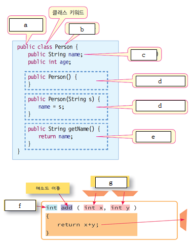

# Java Mentoring Fianl Test
-------
#### 한림대학교 2020 하계멘토링 코딩은쉬워
####  20.7.8 ~ 20.7.22
#### Java를 이용한 객체프로그래밍의 이해
----------
### 1. 자바 프로그램의 컴파일과 실행시키는 과정을 개념적으로 설명하세요(그림참고)
<center>


</center>

```
정답 :
```

### 2. 다음과 같은 코드에서 질문에 답하세요.
```Java
1)

int x = 10;
int y = x++%5;

  (1) 코드가 실행된 후에 x와 y의 값은 무엇인가요?

  (2) 만약 두 번째 문장이 int y = ++x%5; 이었다면 y와 x의 값은 어떻게 되나요?


2) 다음의 프로그램에서 println()으로 출력 값은 무엇입니까?

class Demo {
    public static void main(String[] args){
        int i = 3;
        i++;
        System.out.println(i);    //  
        ++i;                     
        System.out.println(i);    //  
        System.out.println(++i);  //  
        System.out.println(i++);  //
        System.out.println(i);    //
    }
}
```

### 3. 다음과 같이 구구단을 출력하는 프로그램을 작성하세요.
```
1		
2	4		
3	6	9		
4	8	12	16		
5	10	15	20	25		
6	12	18	24	30	36		
7	14	21	28	35	42	49		
8	16	24	32	40	48	56	64		
9	18	27	36	45	54	63	72	81		
10	20	30	40	50	60	70	80	90	100
```
```java
정답 :
```

### 4. 키보드에서 영문자 하나를 읽어서 모음(a,e,i,o,u)과 자음을 구분하는 프로그램을 작성하여 보자. </br>switch 문을 사용하여 문자를 구분합니다. (단, 출력이 다음과 같아야 합니다.)
```
▶ 검사할 영문자를 입력하세요 (종료 : 숫자 0)
3
▶ 영문자가 아닙니다
▶ 검사할 영문자를 입력하세요 (종료 : 숫자 0)
A
▶ 모음입니다
▶ 검사할 영문자를 입력하세요 (종료 : 숫자 0)
b
▶ 자음입니다
▶ 검사할 영문자를 입력하세요 (종료 : 숫자 0)
e
▶ 모음입니다
▶ 검사할 영문자를 입력하세요 (종료 : 숫자 0)
0
▶ 종료합니다
```

```java
정답 :
```

### 5. 인터넷에서 가장 저렴한 TV를 구입하고자 한다. </br> 인터넷에서 판매되는 가격이 1차원 배열 prices[]에 저장되어 있다. </br> prices의 최소가격을 출력할 수 있도록 프로그램을 작성하세요.
```java
int prices[] = {200, 300, 255, 520, 100, 600};
```
```java
정답 :
```

### 6. 다음 빈칸에 들어갈 알맞은 단어를 쓰세요.


<center>



</center>

```
정답 : a)     b)      c)      d)      e)      f)      g)
```

### 7. 다음질문에 답하세요
```Java
1) 다음 프로그램에서 잘못된 부분은 무엇인가? 올바르게 수정하시오.

class Rectangle
{
	int width, height;
	int area() { return width*height; }
}
public class Test {
    public static void main(String[] args)
    {
        Rectangle myRect = Rectangle();
        myRect.width = 10;
        myRect.height = 20;
        System.out.println("면적은 " + myRect.area());
    }
}

2) 알맞은 출력을 쓰세요

class Point {
	int x, y;
}
public class Test {
    public static void main(String [] args) {
        Test obj = new Test();
        obj.sub();
    }
    void sub() {
        Point p = new Point();
        p.x = 10;
        p.y = 20;
        set(p);
        System.out.println(p.x + "," + p.y);
    }
    void set(Point p) {
    	p.x = 30;
    	p.y = 40;
    }
}

정답 :
```
