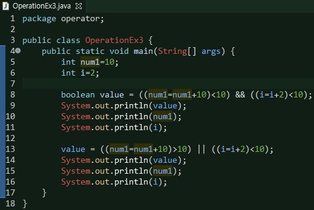

## 1회 - JVM 기초 및 변수와 자료형

#### 자바다운로드 및 환경설정 세팅
https://jhnyang.tistory.com/224


#### JDK 설치
https://www.oracle.com/kr/java/technologies/javase-downloads.html

#### JRE 설치
https://www.oracle.com/java/technologies/javase-jre8-downloads.html

#### Eclipse 설치
https://www.eclipse.org/downloads/

#### Eclipse Error
https://lucaskim.tistory.com/26

### 1장


#### 01-1 프로그래밍과 자바
프로그래밍이란
컴퓨터가 프로그램 만드는 일을 프로그래밍이라하고 프로그램 만드는 사람을 프로그래머라고 합니다.
프로그래밍을 한다는 것은 컴퓨터가 일을 하도록 컴퓨터 언어로 명령을 만들고 컴퓨터로 하여금 그명령을 실행하게 하는 것을 말합니다. 그러면 '프로그램이란 무엇일까요?' 한마디로 프로그램은 컴퓨터에게 일을 시키는 명령의 집합이라고 할 수 있습니다.
예를 들어 1부터 100까지 더하라고 명령을 하고 싶습니다. 컴퓨터는 그 명령을 알아들을 수 있는 프로그래밍언어를 사용하여 명령 집합을 만드는 것입니다.그리고 이렇게 만든 프로그램이 프로그래밍 언어 문법이 잘 맞는지 확인하고 컴퓨터가 이해할 수 있는 언어로 번역해야 합니다.이 작업이 바로 컴파일러 입니다.결국 우리가 말하는 프로그램이란 프로그램에 들어 있는 명령집합과 컴파일된 결과물까지 포함한다고 생각하면 됩니다.

#### 컴퓨터가 이해할 수 있는 언어는 무엇일까요?
컴퓨터가 이해할 수 있는 언어는 기계어입니다. 기계어는 0과1로 이루어져있고 컴퓨터는 0과1의 조합만 이해할 수 있기 때문입니다. 프로그래밍언어는 사람이 이해하기 쉬울수록 고급언어이고 컴퓨터가 이해하기 쉬울수록 저급 언어입니다. 우리가 배울 자바는 고급언어이고 대표적인 저급언어는 어셈블리어가 있습니다.

#### 자바를 쓰면 어떤점이 좋을까요?
플랫폼에 영향을 받지 않으므로 다양한 환경에서 사용할 수 있습니다.
여기서 플랫폼이란 실행되는 환경을 의미합니다.(예 리눅스나 윈도우
객체 지향 언어이기 때문에 유지보가 쉽고 확장성이 좋습니다.(객체란 프로그램 대상을 말함)
프로그램이 안정적입니다.
품부한 기능을 제공하는 오픈소스입니다.

#### 자바 가상 머신과 JIT컴파일러
자바 가상 머신은 (JVM)은 자바 프로그램 실행 환경을 만들어 주는 소프트웨어입니다.
자바 코드를 컴파일하여 .class 바이트 코드로 만들면 이 코드가 자바 가상 머신 환경에서 실행됩니다.
현재 사용하는 컴퓨터 운영체제에 맞는 자바 실행 환경(JRE)이 설치되어 있다면 자바 가상 머신이 설치되어 있는 것입니다.
JIT컴파일러는 실행 시점에 기계어 코드를 생성하는데 같은 코드가 반복되면 매번 기계어 코드를 새로 생성하지 않고 이전에 만든 기계어를 재사용합니다. 또한 JIT컴파일러는 운영체제에 맞게 바이트 실행 코드로 한번에 변환하여 실행하기 때문에 이전의 자바 해석기방식보다 성능이 엄청나게 좋습니다.

#### 01-2 첫 프로그램 만들기


실행결과


#### 연습문제
Q1 프로그램(코드)을 기계가 이해할 수 있는 언어로 바꾸는 작업을 컴파일 이라고 합니다.

Q2 객체 지향 언어는 자바나 C++와 같이 대상이 되는 객체를 기반으로 프로그램을 구현하는 언어입니다.

Q3 자바로 만든 프로그램은 자바가상머신이 설치되어 있으면 운영체제와 상관없이 실행 할수 있습니다.

Q4 자바개발을 위해 설치하는 자바 라이브러리를 JDK라고 합니다.

Q5 자바 프로그램이 실행되는 자바 실행 환경을 JRE라고 합니다.

Q6 두번째 프로그램을 만들어 보세요 이클립스에서 'Hello, Java' 대신 여러분의 이름을 출력해보세요.

### 2장

#### 02-1 컴퓨터는 데이터를 어떻게 표현할까?
##### 컴퓨터에서 수를 표현하는 방법
우리가 사용하는 모든 데이터는 컴퓨터 내부에서 0과1로 이루어져 있습니다. 컴퓨터 내부를 구성하는 반도체가 데이터를 0과1로만 표현할 수 있기 때문입니다.이렇게 0과1로 표현할 수 있는 최소단위를 비트라고 하며 8비트가 모이면 1바이트가 됩니다.

##### 10진수와 2진수
0부터 9까지 한자릿수이고 10부터는 두자릿수가 됩니다. 이를 10진수라고합니다.
컴퓨터내부에서는 0과1로 표현하기 때문에 2진수를 사용합니다.

##### 비트로 표현할 수 있는 범위
컴퓨터는 몇 비트로 표현하느냐에 따라 수의 범위를 결정합니다. 컴퓨터는 2진수로 수를 표현하기 때문에 비트 수가 n개일때 2진수로 나타낼 수 있는 2의n개입니다. 비트가 한개라면 2의1승의 수를 표현할 수 있으므로 범위는 0~1이 됩니다.

##### 부호 있는 수를 표현하는 방법
컴퓨터는 숫자를 0과1로만 표현할 수 있기 때문에 부호 또한 0과1로 표현합니다. 부호를 나타내는 비트는 맨 앞에 붙이며 부호비트라고 부릅니다. 부호비트가 0이면 양수 1이면 음수를 나타냅니다.


#### 02-2 변수란 무엇인가?
변수는 말 그대로 변하는 수입니다. 
변수를 선언하기 위해서는 어떤형태의 자료를 저장할 것인지를 정해야 합니다. 사람의 나이를 저장하려면 정수형태를 써야하고
이름을 저장하려면 문자형태를 써야 합니다. 이러한 형태를 변수의 자료형이라고 합니다. 그리고 변수이름도 정해주어야 합니다.


##### 변수선언하여 사용하기


##### 변수 초기화 하기


##### 변수 이름 정하기
변수이름은
1. 영문자(대문자,소문자)나 숫자를 사용할 수 있고
2. 특수문자 중에는 $,_만 사용 할수 있습니다.
3. 변수이름은 숫자로 시작할 수 없습니다.
4. 자바에서 이미 사용중인 예약어는 사용할 수 없습니다.

***※ 예약어란 프로그래밍 언어에서 특별한 의미로 미리 약속되어 있는 단어를 말합니다.***

```java
int speed;
long earthPopulation; // 변수명 구분을 쉽게하기 위해 주로 space대신 대문자를 사용
int earthPopulation;
int _count; // _허용기호
long $value; // $ 허용기호
int 반복횟수; // 유니코드 지원으로 한글가능
int Henry8; // 변수이름 숫자로 시작가능
int 1stPrizeMoney; // 첫글자가 숫자
double class; // 예약어 불가
int #ofComputer; // 허용기호 x
```
#### 02-3 변수가 저장 되는 공간의 특성 자료형


##### 문자형 연습


##### 실수형 연습


##### 논리형 연습


#### 02-4상수와 리터럴
변하지 않는 수를 상수라고 합니다.
자바에서 상수는 final예약어를 이용하여 선언합니다.

리터럴이란
프로그램에서 사용한 모든 숫자,문자,논리값을 일컫는 말입니다.

#### 02-5형변환
정수와 실수를 더한다고 할때 그대로 연산을 수행할 수없고 하나의 자료형으로 통일후 연산을 수행해야 합니다.

이것을 형변환이라고 합니다.

형변환은 크게 묵시적형변환(자동형변환)과 명시적형변환(강제적형변환)이 있습니다.

1. 바이트 크기가 작은 자료형에서 큰 자료형으로 형변환은 자동으로 이루어집니다.
2. 덜 정밀한 자료에서 더정밀한 자료형으로 형 변환은 자동으로 이루어집니다.

##### 묵시적형변환


##### 명시적형변환


#### 연습문제
Q1 바이트 크기가 작은 자료형을 더 큰 자료형으로 대입하는 형변환 자동으로 이루어집니다.? 예

Q2 실수를 정수형 변수에 대입하는 경우에 형변환이 자동으로 이루어 지고 소수점 이하 부분만 없어집니다.? 아니오

Q3 더많은 실수를 표현하기 위해 가수부와 지수부로 비트를 나누어 표현하는 방식을 부동 소수점 방식이라고 합니다.

Q4 


Q5 


### 3장

#### 03-1 기본연산자
##### 항과 연산자
연산에 사용되는 기호를 연산자라고 합니다. 

우리가 수학시간에 배운 +,-,/,*를 말합니다.

연산에 사용되는 값을 항이라고 합니다. 

- 단항 연산자 -->항이 한개인 연산자 ++num

- 이항 연산자 -->항이 두개인 연산자 num1+num2

- 삼항 연산자 -->항이 세개인 연산자 (5>3) ? 1:0;

- 대입연산자 --> 변수값에 대입하는 연산자 왼쪽변수=오른쪽변수(또는 식)
- 부호연산자,산술연산자,증가 감소 연산자 등이 있습니다.

##### 산술 연산자를 사용하여 총점과 평균 구하기


##### 증가 감소 연산자


##### 관계 연산자
항이 두개인 이항연산자입니다. 두개의 항을 비교합니다.
- '>'  왼쪽항이 크면 참을 아니면 거짓을 반환합니다. num> 3
- '<' 왼쪽이 작으면 참을 아니면 거짓을 반환합니다. num < 3
- '>=' 왼쪽항이 오른쪽항보다 크거나 같으면 참 아니면 거짓을 반환합니다. num >= 3
- '<=' 왼쪽항이 오른쪽항보다 작거나 같은면 참 아니면 거짓을 반환합니다. num <= 3
- '==' 두개의 항이 같으면 참 아니면 거짓을 반환합니다. num==3
- '!=' 두개의 항이 다르면 참 아니면 거짓을 반환합니다. num != 3

##### 논리 연산자
- && 두개항이 참인경우에만 참을 받습니다.
- || 두개항 중에 하나라도 참이면 참입니다.
- ! 단항연산자입니다. 참인경우는 거짓으로 바꿉니다.

##### 관계연산자 및 논리연산자 실습


#### 복합대입 연산자
대입연사자와 다른 연산자를 조합해 다른 하나의 연산자처럼 사용하는 연산자 입니다.

- += 두항의 값을 더해서 왼쪽항에 대입합니다. num1 +=2(num1=num1+2)

- -= 두항의 값을 빼서 왼쪽항에 대입합니다
num1 -= 2(num1=num1-2)

- *= 두항의 값을 곱해서 왼쪽항에 대입합니다.

- /= 두항의 값을 나누어서 왼쪽항에 대입합니다.

#### 조건연산자


#### 연산자 우선순위
1. 단항연산자가 가장 높고 이항,삼항 연산자 순입니다.
2. 대입 연산자의 우선순위가 가장 낮습니다.
3. 산술,관계,논리,대입 연산자 순서로 우선순위를 가지며 ()의 우선순위가 가장 높습니다.

